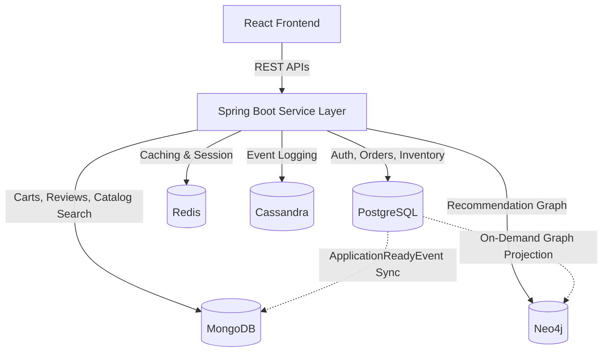

# Siren Reads: Bookstore Management System (Starbucks-Inspired Design) 📖📚

[](https://www.oracle.com/java/)
[](https://spring.io/projects/spring-boot)
[](https://react.dev/)
[](https://www.typescriptlang.org/)
[](https://www.postgresql.org/)
[](https://www.mongodb.com/)
[](https://neo4j.com/)
[](https://cassandra.apache.org/)
[](https://redis.io/)
[](LICENSE)

A retail-flagship styled Bookstore Management platform styled with a premium Starbucks-inspired design. Utilizing **Polyglot Persistence**, this application deploys relational, document, graph, wide-column, and in-memory databases concurrently to handle specific sub-domains.

---

## 📖 Overview

**Siren Reads** is an online bookstore built on a modern enterprise stack. Inspired by Starbucks' retail design system, the interface balances warm neutral card surfaces, organic accent greens, and micro-scale interactive feedback loops. 

Behind the interface sits a **Spring Boot** API connected to five separate database engines, each mapping to a business domain where its architecture provides optimal read/write, graph, or caching capabilities.

---

## 🚀 Key Features & Visual Gallery

| Feature | Description |
| :--- | :--- |
| **Interactive Shopping Cart** | Uses a **hybrid shopping cart service**. Authenticated user carts are persistently saved to **MongoDB**. Guest carts utilize **Redis** session storage with a 7-day TTL window. Gathers and merges guest data to user profiles upon login, validating inventory stock level checks. |
| **Transactional Checkout** | Instantly builds transaction-traceable orders with UUID keys in **PostgreSQL**. Decrements warehouse product inventory counts automatically upon successful validation checks. |
| **Graph-Based Recommendations** | Computes item collaborative filtering and category/author interest pathways using **Neo4j** graph traversals. Displays real-time relationships like "Customers who bought this also bought..." |
| **Reviews & Feedback Feed** | Users submit review details with star ratings. Strict verification locks review capabilities to verified buyers via PostgreSQL query tests. New comments default to unmoderated and undergo administrative approval. |

---

## 🛠️ Polyglot Database Architecture

Siren Reads divides its business requirements across specialized databases:



Detailed architectural blueprints, domain mappings, and consistency synchronization diagrams can be found in the [Architecture Documentation](docs/architecture.md) and [Feature Inventory](docs/features.md).

---

## ⚙️ Configuration & Databases Setup

All service configurations, including database connection endpoints, port specifications, and credentials, are driven by environment variables.

### 1. Environment Variables Template
Copy [`.env.example`](.env.example) to `.env` in the project root:
```bash
cp .env.example .env
```
Key configuration settings:
- **`POSTGRES_PASSWORD`**: Postgres server authentication password.
- **`NEO4J_PASSWORD`**: Neo4j graph database credential.
- **`JWT_SECRET`**: Base64 signing token used by Spring Security.
- **`VITE_API_BASE_URL`**: Target endpoint routing for React.

### 2. Choosing and Running Databases

The application supports running all five databases simultaneously via Docker:

* **Using Docker Compose (Recommended)**
  Spins up all 5 database nodes, Redis Commander, Cassandra schema initializers, the Backend, and the React Frontend:
  ```bash
  docker compose up -d --build
  ```

* **Running Databases Only (For Local Development)**
  Runs the database containers in the background, allowing you to run backend and frontend natively:
  ```bash
  docker compose up -d postgres mongodb redis neo4j cassandra cassandra-init
  ```

* **Flyway Migrations**: PostgreSQL database schemas and catalog tables are initialized and version-tracked automatically using Flyway migrations upon Spring Boot launch.

---

## 💻 Getting Started Locally

### Prerequisites
- **Java JDK 17+** (JDK 21 or 25 recommended for local builds)
- **Node.js 18+**
- **Docker & Docker Compose**

### 1. Build and Run Backend
1. Spin up the docker databases:
   ```bash
   docker compose up -d postgres mongodb redis neo4j cassandra cassandra-init
   ```
2. Navigate to the backend directory and launch the Spring Boot app:
   ```bash
   cd backend
   ./gradlew bootRun
   ```
   The backend starts on `http://localhost:8080`.

### 2. Build and Run Frontend
1. Navigate to the frontend directory:
   ```bash
   cd frontend
   npm install
   npm run dev
   ```
   Open `http://localhost:5173` to explore the storefront app.

---

## 🔗 Demo URLs & Demo Accounts

- **Storefront URL**: [http://localhost:5173](http://localhost:5173) (or [http://localhost:5174](http://localhost:5174) in Docker mode)
- **Backend API Docs (Swagger UI)**: [http://localhost:8080/swagger-ui/index.html](http://localhost:8080/swagger-ui/index.html)
- **Redis Commander UI**: [http://localhost:8082](http://localhost:8082)

Demo accounts are intended for local development only. Set demo passwords through local seed data or environment-specific scripts, and rotate/remove any seeded credentials before publishing a deployed instance.

---

## 🎨 Design System & Typography

The UI uses [`design.md`](design.md) as a visual design reference only. Do not commit official Starbucks logos, artwork, fonts, or other proprietary brand assets unless you have explicit license permission.

> [!IMPORTANT]
> **Domain vs. Brand separation**: While the UI uses the Starbucks `design.md` file as a visual and interaction design reference (colors, layouts, typography, spacing, and styling), the product domain is strictly a Bookstore/Library Management System. All domain concepts, data models, database table names, API routes, and user interface text remain book-focused (using terms like *Book*, *Author*, *Edition*, *Format*, *Bookmark*, *Wrap*, *Stock*, etc., with no coffee or beverage-related terminology).

- **Color blocks**: Page structures utilize Paper-Warm Cream Canvas backgrounds (`#f2f0eb`), deep house-green header bands, and vibrant green CTAs (`#00754A`).
- **Pill Borders**: Action elements are styled with a universal 50px pill radius.
- **Micro-interactions**: Interactive components trigger soft transitions and hover scale shifts (`active:scale-95`).
- **Typography Scale**: Built on **SoDo Sans** style typography (`SoDoSans, Inter, sans-serif`) with tight negative tracking (`letter-spacing: -0.01em`) applied to the body container to produce a clean, compact retail feel.

---

## 📄 License
This project is licensed under the [MIT License](LICENSE).
