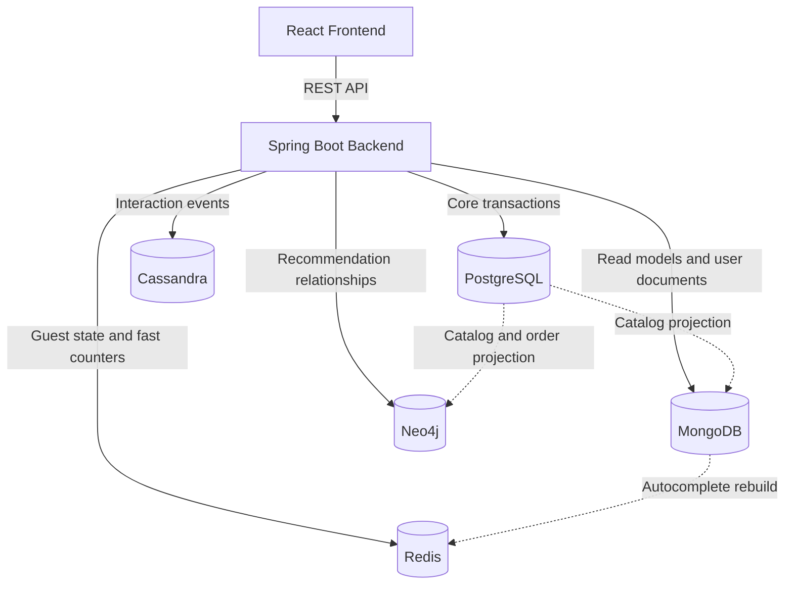

# Siren Reads Bookstore Management System

[](https://www.oracle.com/java/)
[](https://spring.io/projects/spring-boot)
[](https://react.dev/)
[](https://www.typescriptlang.org/)
[](https://www.postgresql.org/)
[](https://www.mongodb.com/)
[](https://neo4j.com/)
[](https://cassandra.apache.org/)
[](https://redis.io/)
[](LICENSE)

Siren Reads is a full-stack bookstore management system built with Spring Boot, React, and a polyglot persistence backend. The application separates transactional, document, graph, event, and cache workloads so each storage engine supports the part of the product it fits best.

The top-level README is intentionally short. Database-specific reasoning and service-level logic live closer to the implementation:

- [Backend logic guide](backend/README.md)
- [Service layer database decisions](backend/src/main/java/com/bookstore/service/README.md)
- [Neo4j graph module guide](backend/src/main/java/com/bookstore/graph/README.md)
- [Database schema guide](db/README.md)
- [Architecture overview](docs/architecture.md)
- [Feature inventory](docs/features.md)

## What The App Does

| Area | Highlights |
| :--- | :--- |
| Storefront | Catalog browsing, book details, search, reviews, wishlist, cart, checkout, and order history. |
| Staff tools | Inventory, suppliers, purchase orders, receiving goods, stock adjustments, and transaction history. |
| Admin tools | Book, author, publisher, category, user, review, session, CDC, catalog, and analytics dashboards. |
| Recommendations | Related books, collaborative recommendations, content-based suggestions, and graph analytics. |
| Data platform | PostgreSQL, MongoDB, Redis, Cassandra, and Neo4j run together through Docker Compose. |

## System Topology



## Quick Start

### Prerequisites

- Java JDK 17+
- Node.js 18+
- Docker and Docker Compose

### Configure Environment

Copy the template and set local secrets before starting services:

```bash
cp .env.example .env
```

Important variables include:

- `POSTGRES_PASSWORD`
- `NEO4J_PASSWORD`
- `JWT_SECRET`
- `VITE_API_URL`

### Run Everything With Docker

```bash
docker compose up -d --build
```

Docker mode exposes:

- Frontend: [http://localhost:5174](http://localhost:5174)
- Backend API: [http://localhost:8081](http://localhost:8081)
- Swagger UI: [http://localhost:8081/swagger-ui/index.html](http://localhost:8081/swagger-ui/index.html)
- Redis Commander: [http://localhost:8082](http://localhost:8082)
- Neo4j Browser: [http://localhost:7475](http://localhost:7475)

### Run Databases Only

Use this mode when developing the backend and frontend locally:

```bash
docker compose up -d postgres mongodb redis neo4j cassandra cassandra-init
```

Then start the backend:

```bash
cd backend
./gradlew bootRun
```

And start the frontend:

```bash
cd frontend
npm install
npm run dev
```

Local development mode usually exposes:

- Frontend: [http://localhost:5173](http://localhost:5173)
- Backend API: [http://localhost:8080](http://localhost:8080)
- Swagger UI: [http://localhost:8080/swagger-ui/index.html](http://localhost:8080/swagger-ui/index.html)

## Repository Map

```text
.
+-- backend/                  Spring Boot API and business logic
+-- frontend/                 React + TypeScript application
+-- db/                       Database schema references
+-- docs/                     Architecture, feature, and publication notes
+-- seed-data/                Optional graph/performance seed data
+-- docker-compose.yml        Full local multi-database stack
`-- .env.example              Environment template
```

## Design Notes

The visual design references a premium retail style, but the product domain remains strictly bookstore-focused. Do not commit official third-party brand assets, logos, fonts, or artwork unless the project has permission to use them.

## Local Demo With ngrok

Create a temporary public demo URL for reviewers using ngrok.

### Prerequisites

- Docker
- Docker Compose
- ngrok ([download](https://ngrok.com/download))

### Setup

1. Create the demo environment file:

   ```bash
   cp .env.demo.example .env.demo
   ```

2. Start backend and databases:

   ```bash
   docker compose --env-file .env.demo -f docker-compose.demo.yml up -d --build \
     postgres mongodb redis neo4j cassandra cassandra-init backend
   ```

3. Check backend health:

   ```bash
   curl http://localhost:8081/actuator/health
   ```

4. (Optional) Load demo users:

   ```bash
   docker compose --env-file .env.demo -f docker-compose.demo.yml exec -T postgres \
     psql -U bookstore_user -d bookstore < db/demo-users.sql
   ```

   Demo accounts:

   | Role | Email | Password |
   | :--- | :--- | :--- |
   | Admin | `admin.demo@example.test` | `Demo@12345` |
   | Customer | `customer.demo@example.test` | `Demo@12345` |

5. Start backend ngrok tunnel:

   ```bash
   ngrok http 8081
   ```

6. Copy the backend ngrok URL (e.g. `https://your-backend-url.ngrok-free.app`) and set it in `.env.demo`:

   ```env
   VITE_API_URL=https://your-backend-url.ngrok-free.app/api
   ```

7. Build and start the frontend (rebuilds with the new API URL):

   ```bash
   docker compose --env-file .env.demo -f docker-compose.demo.yml up -d --build frontend
   ```

8. Start frontend ngrok tunnel in another terminal:

   ```bash
   ngrok http 5174
   ```

9. Copy the frontend ngrok URL (e.g. `https://your-frontend-url.ngrok-free.app`) and add it to `SECURITY_CORS_ALLOWED_ORIGINS` in `.env.demo`:

   ```env
   SECURITY_CORS_ALLOWED_ORIGINS=http://localhost:5174,http://localhost:5173,https://your-frontend-url.ngrok-free.app
   ```

10. Restart backend so CORS picks up the frontend ngrok origin (no `--build` needed — `SECURITY_CORS_ALLOWED_ORIGINS` is a runtime env var):

    ```bash
    docker compose --env-file .env.demo -f docker-compose.demo.yml up -d backend
    ```

11. Share only the **frontend** ngrok URL with reviewers.

### Stop Demo

```bash
docker compose --env-file .env.demo -f docker-compose.demo.yml down
```

To also remove all demo data (disposable):

```bash
docker compose --env-file .env.demo -f docker-compose.demo.yml down -v
```

### Important Notes

- Do not share the backend ngrok URL as the primary demo URL.
- Do not expose database or admin utility ports through ngrok.
- ngrok URLs usually change when restarted unless you have a reserved domain.
- The frontend static build bakes in `VITE_API_URL`; changing the backend ngrok URL requires rebuilding the frontend.
- Changing the frontend ngrok URL requires updating `SECURITY_CORS_ALLOWED_ORIGINS` and restarting the backend.
- Demo data is disposable.
- Auth limitation over ngrok: The refresh-token cookie uses `SameSite=Lax` and `Secure` flags. When the frontend and backend are on different ngrok domains, cookies are not sent on cross-site subresource requests. Login, refresh, and logout will likely fail in this scenario. This cookie behavior is not changed without stronger-model/human review. As a workaround, use a single ngrok tunnel pointing at a local reverse proxy that serves both frontend and backend on the same origin.

## License

This project is licensed under the [MIT License](LICENSE).
