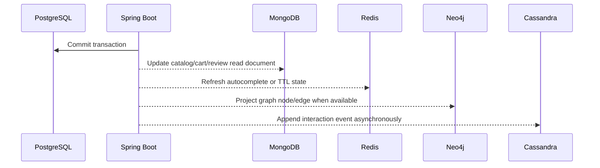

# Backend Logic Guide

The backend is a Spring Boot application that coordinates five data stores from one service layer. PostgreSQL remains the transactional source of truth, while MongoDB, Redis, Cassandra, and Neo4j are used where their data models match the product behavior more naturally.

## Runtime Responsibilities

| Store | Main Backend Packages | Responsibilities |
| :--- | :--- | :--- |
| PostgreSQL | `entity`, `repository`, `service` | Users, customers, staff, books, inventory, orders, purchase orders, suppliers, sessions, refresh tokens, and materialized reporting views. |
| MongoDB | `entity.mongodb`, `repository.mongodb`, selected services | Persistent user carts, wishlists, reviews, catalog read models, and book detail/search documents. |
| Redis | `config.RedisConfig`, `GuestCartService`, `SearchAutocompleteService`, `RedisSearchController`, `RateLimitService` | Guest carts with TTL, autocomplete index, trending search counters, fast lookup state, and rate-limit counters. |
| Cassandra | `entity.InteractionEvent`, `repository.InteractionEventRepository`, `InteractionEventService` | Append-style interaction events such as views, clicks, searches, purchases, reviews, likes, bookmarks, and shares. |
| Neo4j | `graph.*`, projection services | Book/customer graph projection, purchases, ratings, views, bought-together edges, recommendations, and graph analytics. |

## Why The Backend Uses Multiple Databases

The application avoids forcing every workflow into a single persistence model:

- Transactional workflows stay in PostgreSQL because checkout, inventory deduction, purchase orders, and role-based account data need ACID guarantees and relational constraints.
- User-facing flexible documents live in MongoDB because carts, wishlists, reviews, and read models change shape more often than core transactional tables.
- Short-lived and score-based data lives in Redis because guest carts need expiry and autocomplete/trending features need very fast sorted/hash operations.
- Interaction history goes to Cassandra because event tracking should be append-friendly and should not slow down checkout, search, or page rendering.
- Recommendation relationships live in Neo4j because collaborative, content-based, and bought-together queries are relationship traversals, not table scans.

## Important Logic Entry Points

- `CartService`: authenticated cart persistence in MongoDB with stock validation against PostgreSQL.
- `GuestCartService`: anonymous cart persistence in Redis with seven-day TTL renewal and PostgreSQL stock validation.
- `BookSyncService`: startup projection from PostgreSQL catalog tables into MongoDB search documents, followed by Redis autocomplete rebuild.
- `BookSearchService`: MongoDB-backed catalog search and filter read path.
- `SearchAutocompleteService`: Redis sorted-set autocomplete, trending keywords, and trending books.
- `ReviewService`: MongoDB review documents with PostgreSQL verified-purchase checks and Neo4j rating projection after moderation.
- `OrderService`: PostgreSQL order creation, inventory deduction, payment status calculation, and order response snapshots.
- `InteractionEventService`: asynchronous Cassandra write path for user interaction telemetry.
- `BookGraphProjectionService`, `CustomerGraphProjectionService`, `OrderGraphProjectionService`: projection services that keep Neo4j useful without making graph writes part of the primary transaction.

Detailed service-by-service database reasoning is in [service/README.md](src/main/java/com/bookstore/service/README.md). Neo4j-specific relationship logic is in [graph/README.md](src/main/java/com/bookstore/graph/README.md).

## Consistency Model

The backend uses PostgreSQL for authoritative transactional state and projects selected facts outward:

This keeps business-critical writes simple while allowing read models, caches, graph projections, and analytics logs to be rebuilt or repaired independently.
