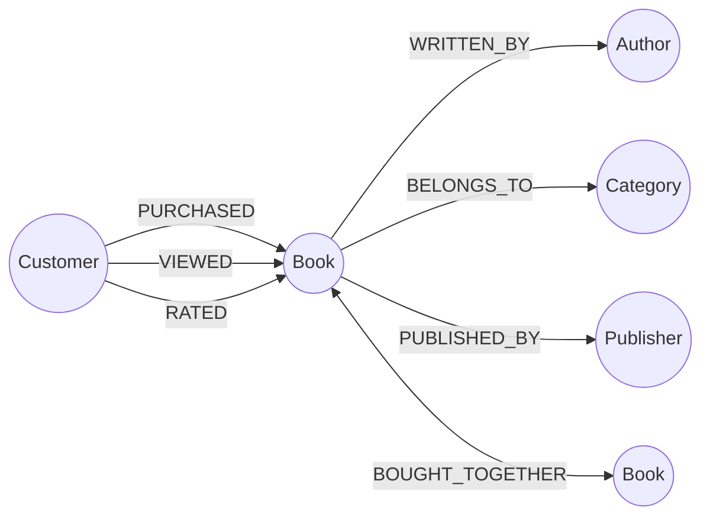

# Neo4j Graph Module Guide

The `graph` package contains the Neo4j projection, recommendation, and analytics layer. Neo4j is used here because the core questions are relationship questions: who bought the same books, which books belong to the same author/category path, and which titles repeatedly appear together in the same order.

## Why Neo4j Here

Recommendation workloads are awkward in a purely relational model because they repeatedly traverse many-to-many relationships:

- Customer to purchased books.
- Book to author, category, and publisher.
- Book to book co-purchase relationships.
- Customer to viewed or rated books.

Neo4j stores those relationships directly, so the recommendation services can express business questions as graph traversals instead of recursive joins or repeated application-side joins.

## Core Services

| Class | Responsibility |
| :--- | :--- |
| `GraphInteractionService` | Writes graph interactions: purchases, views, ratings, book projection, customer projection, and deactivation markers. |
| `GraphRecommendationService` | Reads recommendation results: collaborative filtering, content-based recommendations, bought-together suggestions, graph book details, and graph reviews. |
| `GraphAnalyticsService` | Reads graph analytics used by admin and analytics screens. |
| `BookGraphProjectionService` | Projects PostgreSQL book data into Neo4j and marks missing/deleted books. |
| `CustomerGraphProjectionService` | Projects customer profile changes into Neo4j. |
| `OrderGraphProjectionService` | Projects completed order information into purchase and co-purchase relationships. |

## Relationship Model



## Implemented Recommendation Logic

### Collaborative Filtering

Implemented in `GraphRecommendationService.getCollaborativeRecommendations`.

The query finds customers who purchased at least one same active book as the current customer, then recommends active books those similar customers purchased but the current customer has not. This is a natural Neo4j fit because the useful signal is the path:

```text
Customer -> PURCHASED -> Book <- PURCHASED <- SimilarCustomer -> PURCHASED -> RecommendedBook
```

Benefit: the database follows the relationship path directly and scores recommendations from shared books, similar customers, and average rating.

### Content-Based Recommendations

Implemented in `GraphRecommendationService.getContentBasedRecommendations`.

The query recommends books that share the same author or category as the current book. Author matches receive a higher score than category-only matches.

Benefit: the graph keeps author/category relationships as first-class edges, so similar-book suggestions can be built without denormalizing every possible pair in PostgreSQL.

### Bought-Together Recommendations

Implemented in `GraphRecommendationService.getBoughtTogetherRecommendations` and maintained by `GraphInteractionService.updateBoughtTogether`.

When an order contains multiple books, the service updates `BOUGHT_TOGETHER` relationships between book pairs. The relationship stores co-occurrence count, contributing order IDs, confidence, and last update time.

Benefit: future product pages can read a small weighted graph edge instead of scanning all historical order items on every request.

## Projection And Consistency

Neo4j is a projection, not the source of truth:

- PostgreSQL owns books, customers, orders, and inventory.
- MongoDB owns review documents and moderation state.
- Neo4j receives only the graph-shaped facts needed for recommendations and analytics.

If a graph write fails, the surrounding PostgreSQL or MongoDB operation can still remain valid. Projection services log failures so the graph can be repaired with sync endpoints such as:

- `POST /api/graph/sync/books`
- `POST /api/graph/sync/books/{isbn}`
- `POST /api/orders/sync-graph`

This keeps core business transactions stable while letting the graph serve specialized relationship queries.
