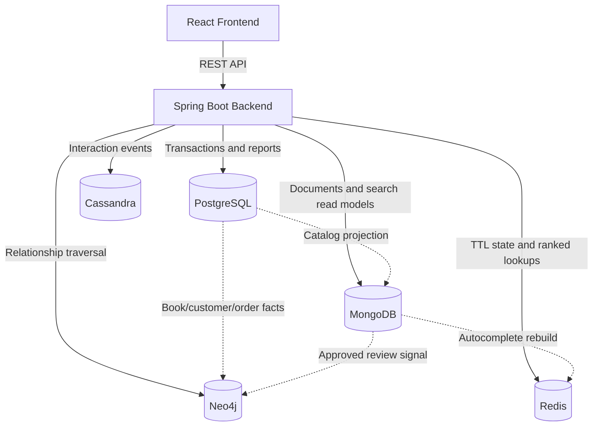

# Architecture Overview

Siren Reads uses a polyglot persistence architecture: one Spring Boot backend coordinates multiple databases, and each database is assigned to the workload it handles best. PostgreSQL owns critical transactions, while MongoDB, Redis, Cassandra, and Neo4j support specialized read models, cache/state, event logging, and relationship queries.

For service-level rationale, see:

- [Backend logic guide](../backend/README.md)
- [Service layer database decisions](../backend/src/main/java/com/bookstore/service/README.md)
- [Neo4j graph module guide](../backend/src/main/java/com/bookstore/graph/README.md)
- [Database schema guide](../db/README.md)

## Topology

## Store Assignments

| Store | Role | Primary Data |
| :--- | :--- | :--- |
| PostgreSQL | Transactional source of truth | Users, customers, staff, books, authors, publishers, categories, inventory, orders, order items, suppliers, purchase orders, sessions, and reporting views. |
| MongoDB | Document read models | Authenticated carts, wishlists, reviews, book details, and catalog search documents. |
| Redis | In-memory state and rankings | Guest carts, autocomplete entries, trending keywords/books, and rate-limit counters. |
| Cassandra | Append-oriented events | User/book interaction events such as views, clicks, searches, purchases, and reviews. |
| Neo4j | Graph projection | Book/customer/author/category/publisher nodes and purchase, view, rating, and co-purchase relationships. |

## Data Flow

### Catalog Read Model

PostgreSQL stores authoritative book data. On application startup, `BookSyncService` reads PostgreSQL books, writes MongoDB search documents, and then rebuilds Redis autocomplete entries from MongoDB.

### Cart Flow

Authenticated carts are stored in MongoDB by `CartService`. Anonymous guest carts are stored in Redis by `GuestCartService` under `guest_cart:<sessionId>` with a seven-day TTL. Both paths validate book status and stock against PostgreSQL before saving quantities.

### Checkout Flow

`OrderService` creates PostgreSQL orders, checks customer profile completeness, verifies stock, deducts inventory, snapshots book fields into order items, and calculates totals inside a transaction. Order facts can later be projected into Neo4j for recommendations.

### Review Flow

`ReviewService` stores review documents in MongoDB, but it first verifies purchase history from PostgreSQL. Reviews default to unmoderated. Once approved, the rating signal is projected into Neo4j so graph recommendations and rating relationships can use it.

### Interaction Event Flow

`InteractionEventService` writes interaction telemetry to Cassandra asynchronously. Event failures are logged but do not fail the main user request.

### Recommendation Flow

Neo4j receives projected books, customers, orders, views, and approved ratings. `GraphRecommendationService` then serves collaborative filtering, content-based recommendations, bought-together recommendations, graph book details, and graph review reads.

## Consistency Strategy

The system avoids distributed transactions across databases to ensure high availability and responsiveness. Instead:

- PostgreSQL commits the authoritative business transaction.
- MongoDB, Redis, Cassandra, and Neo4j receive specialized documents, keys, events, or graph projections.
- We use the **Transactional Outbox Pattern** to reliably sync PostgreSQL changes to MongoDB and Neo4j projections, avoiding drift due to network or service failures.
- Failed outbox events are retried automatically by a background scheduled worker, and administrators can monitor or manually replay them.
- Critical user-facing validation always checks PostgreSQL where stock, orders, and account state are authoritative.

For full architectural details on consistency strategy, database ownership, outbox flow, and retry/replay operations, see [Multi-Database Projections Guide](multi-db-projections.md).
