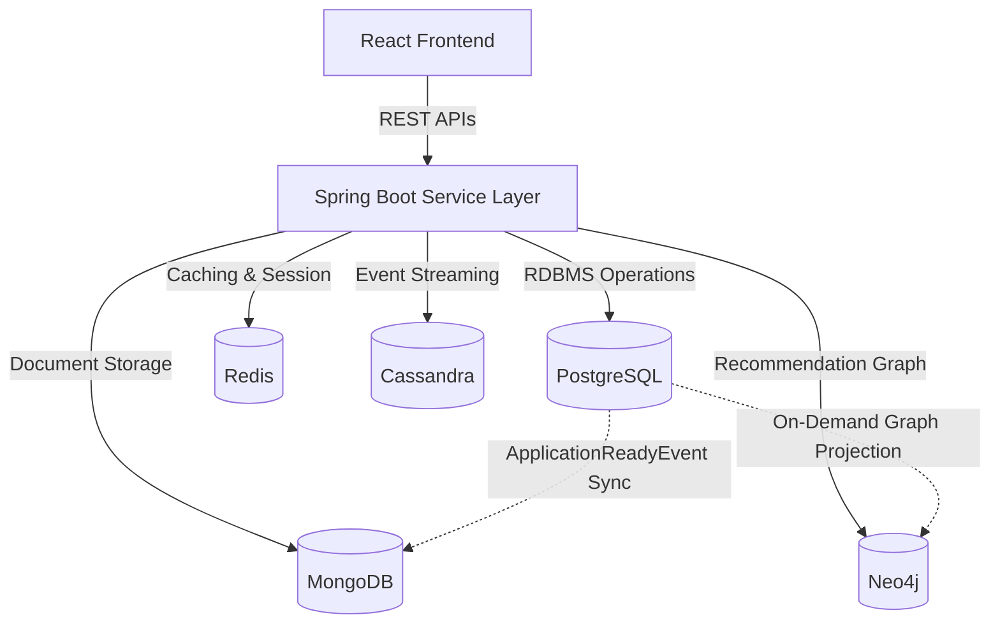

# Architectural Overview - Polyglot Persistence Bookstore

This document details the system architecture and data storage strategies implemented in the Bookstore Management System. The application utilizes a **Polyglot Persistence** architecture, matching individual business domains with the database engine best suited for their storage requirements, consistency models, and query patterns.

---

## 1. System Topology & Data Store Assignments

The backend is built as a single Spring Boot application that manages active connections to five distinct database systems:

### PostgreSQL (Source of Truth)
- **Role**: Core Transactional Engine (RDBMS).
- **Domain**: User authentication records, roles, book catalog metadata (author, publisher, price), inventory stock, purchase orders, invoices, and payment statuses.
- **Why**: Demands strict ACID compliance, transactional integrity, and relational constraints.

### MongoDB (Document Database)
- **Role**: Flexible Schema Document Store.
- **Domain**: Persistent shopping carts (`carts` collection), user wishlists (`wishlists` collection), catalog text-search database (`book_search` collection), and user reviews (`reviews` collection).
- **Why**: Handles high-write operations for active carts, stores complex nested objects like reviews, and supports flexible attributes without rigid schema migration overhead.

### Redis (In-Memory Data Structure Store)
- **Role**: High-Speed Cache & Session Store.
- **Domain**: Anonymous guest carts (`guest_cart:<sessionId>` keys), API rate-limiting trackers, and active login session tokens.
- **Why**: Sub-millisecond read/write latency. Guest carts utilize a 7-day Time-To-Live (TTL) expiration window that automatically renews on cart interactions.

### Cassandra (Wide-Column Store)
- **Role**: Distributed Column Family Store.
- **Domain**: High-frequency clickstream event logs, real-time page views, and user navigation sessions.
- **Why**: Designed for massive write scale. Linear write performance scale supports logging clickstream telemetry without degrading core transactional speeds.

### Neo4j (Graph Database)
- **Role**: Native Graph Engine.
- **Domain**: Recommendations engines, related-book graphs, and user interest networks.
- **Why**: Performs deep relationship traversals (e.g. "Customers who purchased Book A also purchased Book B" or recommendation paths) exponentially faster than recursive SQL JOIN operations.

---

## 2. Synchronization Mechanisms

To maintain consistency across disparate database systems without incurring the overhead of two-phase commits, the system uses asynchronous and event-driven data sync routes:

### Postgres to MongoDB (Catalog Text Search)
- **Mechanism**: `BookSyncService` listens to the Spring Boot `ApplicationReadyEvent`.
- **Sync Routine**:
  1. Triggers at application startup.
  2. Queries all book entities from PostgreSQL.
  3. Converts records into flat `BookSearch` document models.
  4. Upserts records into MongoDB.
- **Visibility constraint**: Search queries (text search, categories, price range filters) only return books where `businessStatus = ACTIVE`. Inactive and discontinued books are automatically hidden.

### Postgres to Neo4j (Graph Recommendation Sync)
- **Mechanism**: Projected updates.
- **Sync Routine**:
  - Automatically maps relational catalog nodes to the Graph network during administrative updates.
  - Can be manually triggered on-demand via the administrative endpoint:
    `POST /api/graph/sync/books`
  - Creates Graph nodes for `Book`, `Author`, `Category`, and `User`, linking them with edges representing purchase and authorship relationships (`PURCHASED`, `WROTE`, `BELONGS_TO`).

---

## 3. High-Security Business & Validation Logic

- **Purchase-Only Reviews**: Users cannot review books unless they have an active customer account and have successfully ordered the target title. This is verified by checking PostgreSQL order tables using `OrderRepository.hasPurchasedBook(customerId, bookId)`.
- **Single Review Constraint**: A user is limited to one review per book.
- **Review Moderation**: Newly created or modified reviews are saved with `moderated = false`. They are excluded from average ratings and public views until approved by an administrator via `PUT /api/reviews/admin/approve/{reviewId}`.
- **Transactional Cart Stock Validation**: Adding or merging items validates the *cumulative* quantity against the PostgreSQL `stockQuantity` (existing cart quantity + requested quantity).
