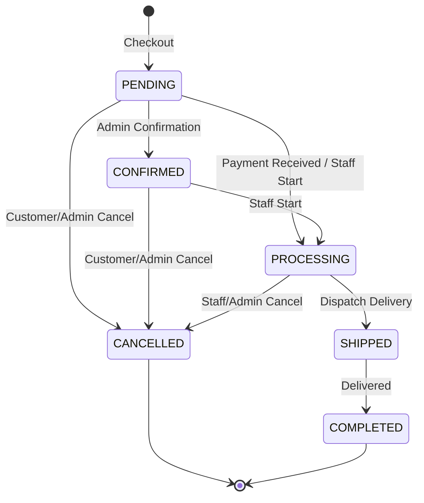
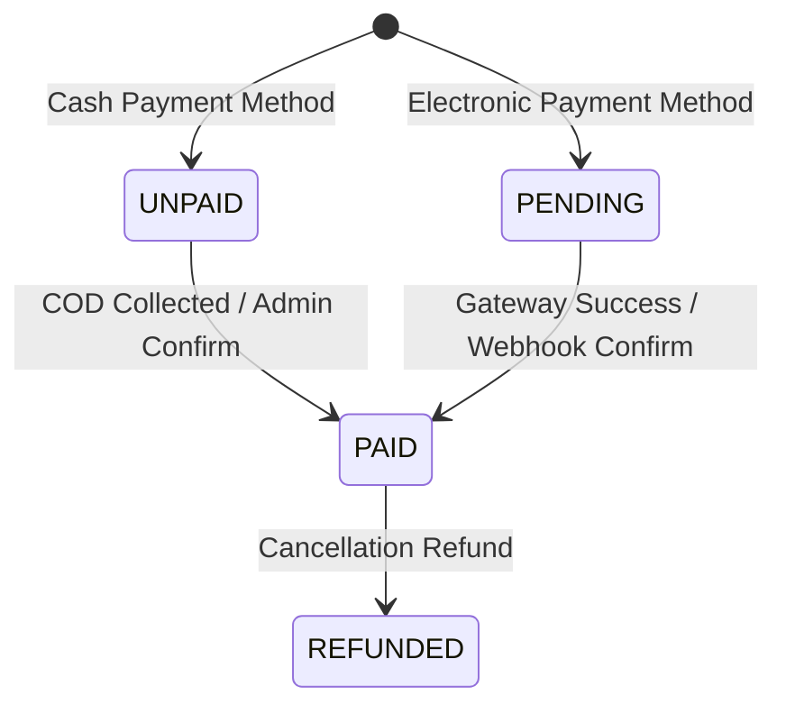

# Order, Payment, and Inventory Domain State Machines

This document outlines the business rules, state machines, and data mutation paths for orders, payments, and inventory management within the Bookstore Management System.

---

## 1. Order Status State Machine

Order statuses represent the current lifecycle phase of a customer purchase. Transitions are governed by the `OrderStatusPolicy` class and enforced at the service layer.

### Transition Matrix
- **PENDING**: Initial state. Can transition to `CONFIRMED`, `PROCESSING`, or `CANCELLED`.
- **CONFIRMED**: Order confirmed. Can transition to `PROCESSING` or `CANCELLED`.
- **PROCESSING**: Items are being packed. Can transition to `SHIPPED` or `CANCELLED`.
- **SHIPPED**: Package is with the delivery service. Can transition to `COMPLETED`.
- **COMPLETED**: Terminal state. No further transitions allowed.
- **CANCELLED**: Terminal state. No further transitions allowed.

*Any transition not listed above throws `InvalidOrderStatusTransitionException`.*

---

## 2. Payment Status Lifecycle

Payment statuses track the financial fulfillment of an order.

- **UNPAID**: Default for Cash on Delivery (COD) orders at checkout.
- **PENDING**: Default for electronic payments (Bank Transfer, Credit Card, E-Wallet) awaiting external gateway callback/webhook or admin confirmation.
- **PAID**: Confirmed payment (payment gateway success or staff COD confirmation).
- **REFUNDED**: Order cancelled after payment was already completed.

---

## 3. Stock Mutation Ownership

To prevent race conditions, overselling, and data discrepancies, all inventory mutations must strictly conform to these rules:

1. **Single Entry Point**: All stock mutations **MUST** be routed through the `InventoryService`. No other service or repository is permitted to directly write or update book stock quantities in the database.
2. **Audit Trail**: Every change in book stock **MUST** result in the creation of an `InventoryTransaction` record.
3. **Pessimistic Locking**: Concurrent purchases and receiving events use `SELECT FOR UPDATE` on Postgres books via `BookRepository.findByIdForUpdate` to ensure serializability.

---

## 4. Inventory Transaction Types

Inventory changes are audited via `InventoryTransaction` records with one of the following `transaction_type` values:

- **SALE_OUT**: Created upon successful checkout. Reduces stock.
- **PURCHASE_IN**: Created when new inventory goods are received against a Purchase Order. Increases stock.
- **ADJUSTMENT**: Created for manual stock adjustments by warehouse staff or during order cancellation/reversal.

### Compensation on Order Cancellation
When an order is cancelled, a compensating transaction is recorded:
- If the order was in `PROCESSING` or prior states, the stock is restored.
- The compensating record is written as a transaction with `quantity_change = +quantity` to exactly reverse the original deduction.
