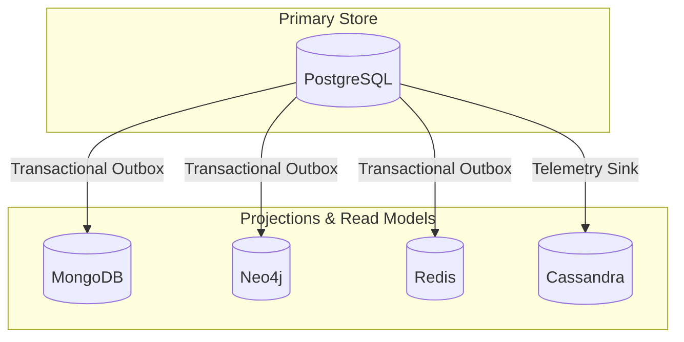
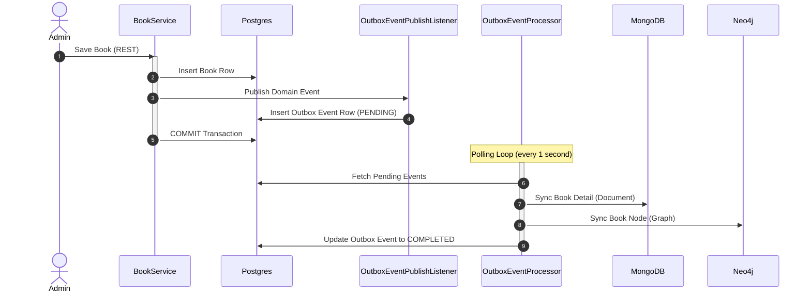

# Multi-Database Projections and Eventual Consistency

This document defines datastore ownership, consistency expectations, and operational guidelines for the Bookstore Management System's polyglot storage architecture.

---

## 1. Datastore Ownership Matrix

PostgreSQL serves as the single source of truth for all business state. All other datastores function as projections, search models, caches, or telemetry sinks.

| Datastore | Authority Level | Owned Data / Domain | Consistency Strategy |
| :--- | :--- | :--- | :--- |
| **PostgreSQL** | **Authoritative (Source of Truth)** | Users, Catalog, Inventory, Purchase Orders, Orders, Payments, Staff | Strong Consistency (ACID) |
| **MongoDB** | Read Model / Projection | Auth Carts, Wishlists, Reviews, Book Search Details | Eventual Consistency (via Transactional Outbox) |
| **Neo4j** | Graph Projection | Books, Customers, Purchases, Ratings, Recommendations | Eventual Consistency (via Transactional Outbox) |
| **Redis** | Cache / Ephemeral Projection | Guest Carts, Autocomplete, Rate Limits, Trending | Ephemeral / TTL-based Caching |
| **Cassandra** | Event Logging | telemetry clickstream, user-book interactions | Eventual Consistency (Async append-only) |

> [!WARNING]
> **Strict Rule**: Never write source-of-truth business facts directly into MongoDB, Neo4j, Redis, or Cassandra without first executing and committing the transaction in PostgreSQL. Projections must always be reconstructible from PostgreSQL historical data.

---

## 2. Transactional Outbox Pattern

To ensure eventual consistency without the overhead of distributed two-phase commit transactions, we use the **Transactional Outbox Pattern** for catalog, customer, and order updates.

### High-Level Data Flow

1. **Transactional Mutation**: A service method (e.g. `BookService.createBook`) updates a PostgreSQL table and publishes a Spring domain event.
2. **Outbox Interceptor**: `OutboxEventPublishListener` intercepts the event in the same thread and writes an entry into the `outbox_events` table as part of the primary PostgreSQL transaction.
3. **Database Commit**: The PostgreSQL transaction commits. The business change and outbox event commit atomically.
4. **Background Worker**: `OutboxEventProcessor` polls the `outbox_events` table for `PENDING` or `FAILED` events.
5. **JSON Deserialization**: The processor maps the payload to the original event class.
6. **Isolated Handler Dispatch**: The processor invokes the target handler (MongoDB or Neo4j update) within an isolated transaction.
7. **Status Update**: The outbox event is updated to `COMPLETED` on success, or `FAILED` on exception (recording error stack traces).

---

## 3. Observability and Replay Administration

When projection sync fails (e.g. MongoDB downtime or Neo4j connection issues), errors are stored inside the database and can be monitored or retried.

### Outbox Schema Details
The `outbox_events` table retains operational metrics:
- `status`: `PENDING`, `COMPLETED`, or `FAILED`.
- `attempts`: Increments on each try (max retries = 5).
- `last_error`: Stores error message stacks for immediate diagnostics without log searching.

### Administration REST Endpoints
Administrators (users with role `ADMIN`) can query and manipulate the outbox queue using the `/api/admin/cdc` endpoints:

- **List Outbox Backlog**:
  `GET /api/admin/cdc/outbox?status={status}`
  Returns a list of outbox events, optionally filtered by status.
- **Inspect Status & Health**:
  `GET /api/admin/cdc/status`
  Returns health status (`HEALTHY`, `DEGRADED`, `DOWN`) and `queueDepth` (count of pending events).
- **Inspect Stats & Metrics**:
  `GET /api/admin/cdc/stats`
  Returns total PostgreSQL/MongoDB counts, success/failure counts, and dynamic success rates.
- **Single Synchronous Retry**:
  `POST /api/admin/cdc/outbox/retry/{id}`
  Resets attempts to 0, sets status to `PENDING`, and runs the projection sync synchronously.
- **Bulk Asynchronous Retry**:
  `POST /api/admin/cdc/outbox/retry-failed`
  Resets all failed outbox events back to `PENDING` to allow the background scheduled worker to process them.
